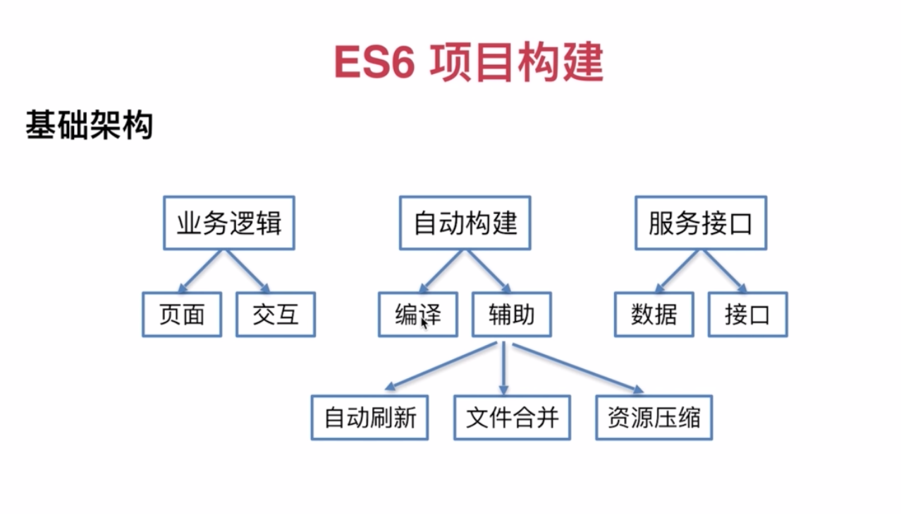

## 一. ES6项目构建
#### 基础构建

#### 任务自动化 (gulp)
* 什么是任务自动化
  * 
* 什么是gulp
  * 
* gulp的作用
  * 
* 了解如何使用gulp完成任务自动化
```js
// 全局安装express和express-generator
sudo npm install -g express sudo npm install -g express-generator
// 进入server目录
cd server
// 当前目录生成express脚手架
express --view=ejs .
```

#### 编译工具 (babel, webpack)
* 什么是babel, webpack
  * 
* babel的核心用法
  * 
* 了解webpack及webpack-stream的作用
  *
#### 代码实现
* 创建一个ES6前端工程

* 完成目录结构，自动构建，服务器搭建